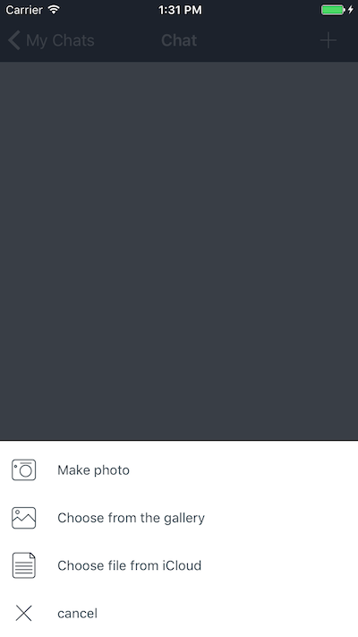

# KKSActionSheet

[](http://cocoapods.org/pods/KKSActionSheet)
[](http://cocoapods.org/pods/KKSActionSheet)
[](http://cocoapods.org/pods/KKSActionSheet)


## Example
To run the example project, clone the repo, and run `pod install` from the Example directory first.




## Requirements
* ios: 8.3. 
* xcode: 6

## Installation
KKSActionSheet is available through [CocoaPods](http://cocoapods.org). To install
it, simply add the following line to your Podfile:

```ruby
pod "KKSActionSheet"
```

If u want add it to version swift2.2

```ruby
pod 'KKSActionSheet', '~> 0.1.5'
```


## Usage
First import lib:
```swift
import KKSActionSheet
```

After create instance:
```swift
let actionSheet = KKActionSheet()
```

Then add data:
```swift
actionSheet.actionSheetData = [KKActionSheetData(image: UIImage(named:"picker_photo"),title: "From lib",complitionHandler:nil),
KKActionSheetData(image: UIImage(named:"picker_camera"),title:"Make photo",complitionHandler:nil),
KKActionSheetData(image: UIImage(named:"picker_close"),title: "Close",complitionHandler: { Void in
print("Handler used")
})]
```

To show action sheet call:
```swift
actionSheet.showActionSheetWithSender(sender:self)
```

Thats all. Its works with navigationBar and without.

Also u can configure some properties:
```swift
/* action sheet height min(50) max(100) */
public var actionSheetItemHeight: CGFloat

/* Colors */
/* textColor for Normal state */
public var actionSheetCellTextColorNormal: UIColor?

/* backgroundColor for Normal state */
public var actionSheetCellBGColorNormal: UIColor?

/* textColor for Highlighted state */
public var actionSheetCellTextColorHighlighted: UIColor?

/* backgroundColor for Highlighted state */
public var actionSheetCellBGColorHighlighted: UIColor?
```

If u want different color for all cells, use it:
```swift
let data = KKActionSheetData(image: UIImage(),title:"1",complitionHandler:nil)
data.titleColor = .orangeColor()


customActionSheet.actionSheetData = [data,
KKActionSheetData(image:UIImage(named:"picker_camera"),title:"2",complitionHandler:nil),
KKActionSheetData(image:UIImage(named:"picker_close"),title: "3",complitionHandler: { Void in
print("HAndler used")
button.backgroundColor = .orangeColor();
})]
```

## Author

k_krizhanovskii, k.krizhanovskii@gmail.com

## License
KKSActionSheet is available under the MIT license. 


Permission is hereby granted, free of charge, to any person obtaining a copy of this software and associated documentation files (the "Software"), to deal in the Software without restriction, including without limitation the rights to use, copy, modify, merge, publish, distribute, sublicense, and/or sell copies of the Software, and to permit persons to whom the Software is furnished to do so, subject to the following conditions:

The above copyright notice and this permission notice shall be included in all copies or substantial portions of the Software.

THE SOFTWARE IS PROVIDED "AS IS", WITHOUT WARRANTY OF ANY KIND, EXPRESS OR IMPLIED, INCLUDING BUT NOT LIMITED TO THE WARRANTIES OF MERCHANTABILITY, FITNESS FOR A PARTICULAR PURPOSE AND NONINFRINGEMENT. IN NO EVENT SHALL THE AUTHORS OR COPYRIGHT HOLDERS BE LIABLE FOR ANY CLAIM, DAMAGES OR OTHER LIABILITY, WHETHER IN AN ACTION OF CONTRACT, TORT OR OTHERWISE, ARISING FROM, OUT OF OR IN CONNECTION WITH THE SOFTWARE OR THE USE OR OTHER DEALINGS IN THE SOFTWARE.

